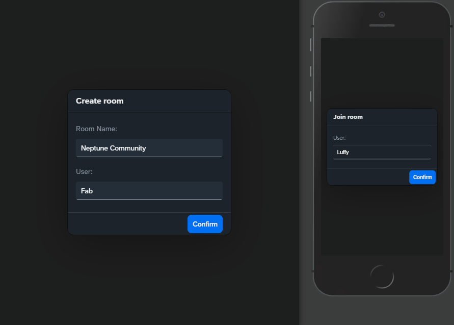

# neptune-uno-card-game
UNO! Card Game built in Neptune (Open Edition) with Redis 
(the demo gif may require some time to load)

## Created with
- Neptune Software (Open Edition)
- OpenUI5 / JavaScript
- Redis
- SCSS

## Prerequisites
- Planet 9 (Open Edition DXP 23 or higher)
- Redis installed / configured in the cockpit settings (you can follow my <a href='https://community.neptune-software.com/topics/tips--tricks/blogs/getting-started-with--redis-and--planet--9' target="_blank">Getting Started</a>)

## Installation
1. Open your Planet 9 instance and go inside the Development Package section
2. Select the Import > Git option
3. In Remote Repository URL paste this GitHub repository `https://github.com/fabriziopace/neptune-uno-card-game.git`
4. Click now on the OK button, this will import all artifacts used in this project
5. You will find a new tile in the Neptune Cockpit > Entertainment section
6. Have fun!

More details on my blog:
- <a href='https://community.neptune-software.com/topics/tips--tricks/blogs/play--u-n-o--card--game-in--neptune-with--redis----git-hub' target="_blank">Neptune Software Blog - Play UNO! Card Game in Neptune with Redis</a>
- <a href='https://fabriziopace.dev/blog/neptune-uno-card-game' target="_blank">Personal Website Blog - Play UNO! Card Game in Neptune with Redis</a>
